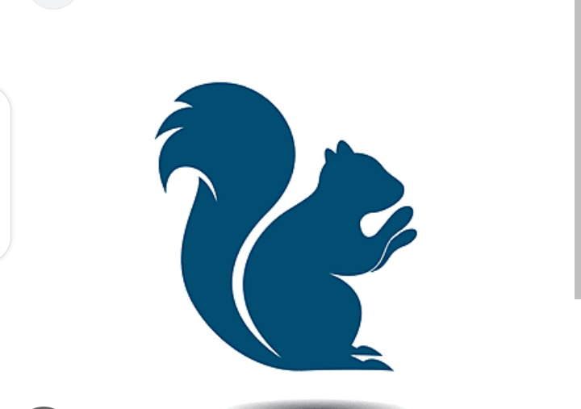

# betasquirrel-example
task from betasquirrel

# suzuki
Assignment from suzuki

## Requirements

|    Requirements               | Output |
| ------------------------------| ------ |
|   | two    |
|   | two    |

### formating

**lorejnfjfsckcnn**cece;knvnvmnc4y*roiwue*cand;u4h2j ~~d3hrbfhe~~

`git commit`

## Linux Camands

- `cd` - change current directory. Ex: `cd desktop`, `cd ..`
- `is` - List contents pf a directory, Ex: `ls -a` lists hidden files as well.
- `pwd` - Display current working directory path
- `Cat` - Display contents of file. Ex: `cat README.md` 

## Git Commands

1. `git config` configure git user. Ex: `git config --global user.name "Muhammedjasim961"`, `git config user.email "jasimwayanad961@gmail.com"`
2. `git clone` clone a remote git repo to your local. Ex: `git clone https://github.com/Muhammedjasim961/suzuki.git`, `git clone https://github.com/Muhammedjasim961/suzuki.git new-folder`
3. `git add` Add your file changes to git. Ex: `git add . ` `gitadd README.md`
4. `git commit` commit changes to git. Ex: `git commit -m "initial commit"`
5. ` git push` push your local commits to remote repo. Ex: `git push origin main`

## task 3

read the below pages and attend the tests

- [HTML](htttps://www.w3schools.com/html/defalt.asp)
- [Attributes](https://www.w3schools.com/html/html_attributes.asp)

# Responsive Design Dimensions

- xs ( >=576 )
- sm ( >=576 )
- md (>=768 )
- lg (>= 992 )
- xl (>=1200 )
-xxl (>=1400 )

- mobile `@media only screen and (max-width: 767px) {}`
- tablet `@media only screen and (max-width: 991px) and (min-width: 768) {}`